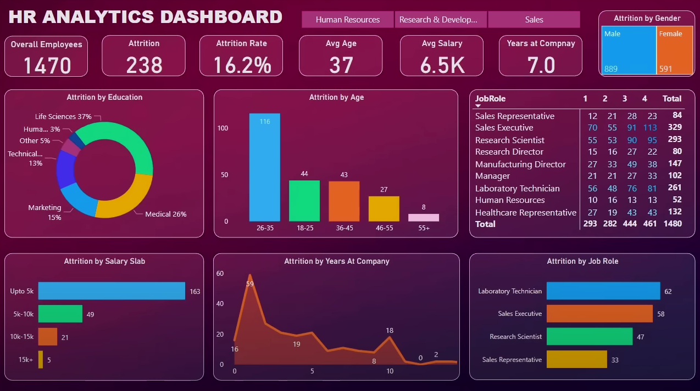

# Power BI Project

This project is a comprehensive Power BI dashboard that was developed by following the tutorial provided in the video [Power BI Tutorial](https://www.youtube.com/watch?v=j4xlVLgsmNQ). The goal of this project is to demonstrate data visualization techniques, dashboard creation, and interactive report generation using Power BI.

## Project Description

In this Power BI project, we focus on the following:

- Importing and transforming data using Power Query.
- Building interactive dashboards with multiple visuals (charts, tables, and filters).
- Enhancing data insights using Power BI features like slicers, drill-throughs, and custom visuals.
- Publishing the Power BI report for sharing and collaboration.

This project is perfect for anyone looking to improve their Power BI skills and understand how to visualize data effectively.

## Tech Stack

The following technologies and tools were used to build the project:

- **Power BI** - The primary tool used for creating the dashboards and reports.
- **DAX** - Data Analysis Expressions were used to perform calculations and create custom metrics.

## Project Image

## Setup Instructions

1. Download and install [Power BI Desktop](https://powerbi.microsoft.com/downloads/).
2. Clone this repository to your local machine.
3. Open the `Power BI` project file (`.pbix`) in Power BI Desktop.

## Usage

- Load the `.pbix` file into Power BI Desktop.
- You will be able to interact with the dashboard by filtering, drilling down, and exploring the data.

## Tech Logos

Below are the logos for the technologies used in this project:

---

If you have any questions or need further assistance, feel free to reach out!
